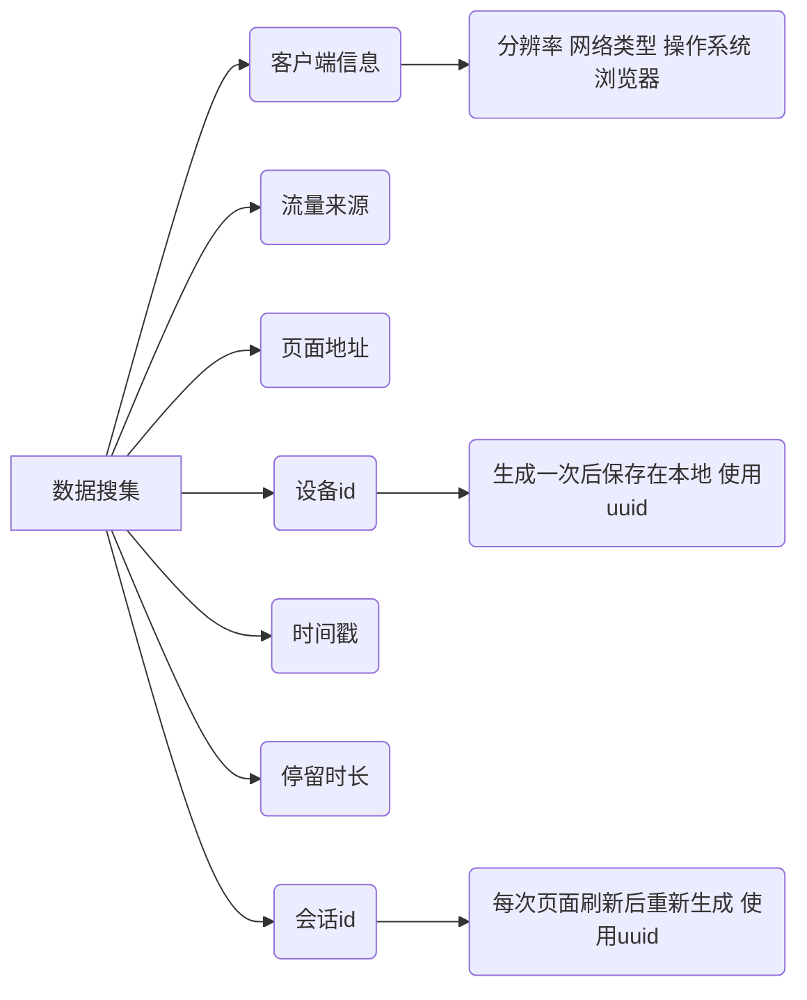

# 前端埋点

### 目的  

做埋点的目的是为了统计用户的信息（来源，ip地址，触发行为，停留事件），分析用户行为，促进产品推广  

### 数据收集

```mermaid
graph LR
A[数据搜集] --> B(客户端信息)
B --> B1(分辨率 网络类型 操作系统 浏览器)
A --> C(流量来源)
A --> D(页面地址)
A --> E(设备id)
E --> E1(生成一次后保存在本地 使用uuid)
A --> F(时间戳)
A --> G(停留时长)
A --> H(会话id )
H --> H1(每次页面刷新后重新生成 使用uuid)
```

